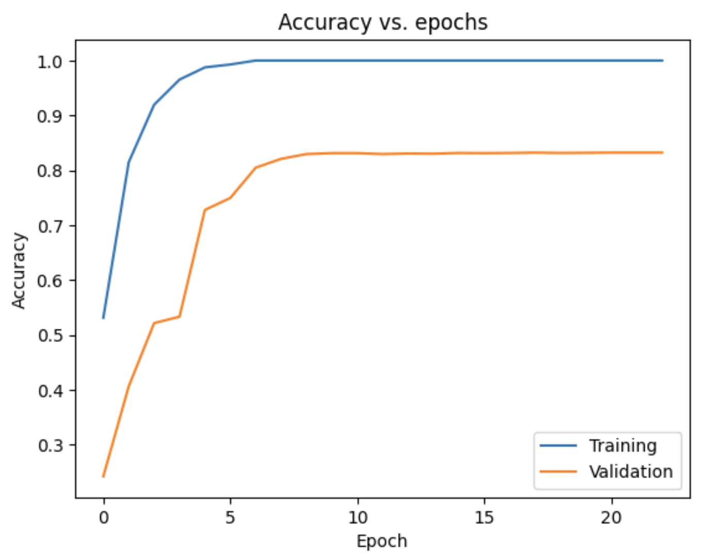

## **1. Land Classification Using EuroSAT Dataset**

### **Overview**
In this project, I classified different land uses and covers using satellite imagery from the EuroSAT dataset. The primary goal was to build a Convolutional Neural Network (CNN) for classification tasks, using techniques like model checkpoints, transfer learning, and performance improvements with regularization and fine-tuning.

---

### **Workflow**

### **1.1 Data Preprocessing**
The preprocessing steps involved:
- **Dataset**: The EuroSAT dataset contains 27,000 labeled Sentinel-2 satellite images across various land-use classes, including residential, industrial, rivers, and forests.
- **Data Loading and Normalization**: I loaded the dataset and normalized the images to scale pixel values between 0 and 1, ensuring better convergence during training.

### **1.2 Model Building**
I developed a base CNN model with the following architecture:
- **Conv2D Layers**: Two convolutional layers with ReLU activation and SAME padding to retain the spatial dimensions.
- **MaxPooling Layer**: This layer reduced the spatial dimensions, capturing the most significant features from the input.
- **Dense Layers**: A couple of fully connected layers followed the convolutional layers. The final output layer consisted of 10 units with softmax activation for classification into the 10 land-use classes.

### **1.3 Training and Evaluation**
I used model checkpoints to save the best-performing model and applied early stopping to halt training when validation accuracy stopped improving. 

The base model results:
- **Final Training Accuracy**: 78.43%
- **Final Test Accuracy**: 71.80%

#### **Loss vs. Epochs Plot (Base Model)**  

#### **Accuracy vs. Epochs Plot (Base Model)**  

#### **Confusion Matrix (Base Model)**  

---

### **1.4 Transfer Learning**
To enhance performance, I applied transfer learning using the pre-trained ResNet50 model. I froze the earlier layers to retain general feature extraction and added custom layers on top.

- **New Layers**: A dense layer with 64 units and a dropout layer was added for regularization, followed by a softmax output layer for classification.
  
The transfer learning model results:
- **Final Training Accuracy**: 93.10%
- **Final Test Accuracy**: 91.60%

#### **Loss vs. Epochs Plot (Transfer Learning Model)**  

#### **Accuracy vs. Epochs Plot (Transfer Learning Model)**  

#### **Confusion Matrix (Transfer Learning Model)**  

---

### **1.5 Model Improvements**
I further improved the model’s performance using regularization techniques:
- **Kernel Regularizer**: I applied L2 regularization to maintain weight consistency.
- **Learning Rate Adjustment**: I used `ReduceLROnPlateau` to dynamically reduce the learning rate when validation accuracy plateaued, improving convergence.
- **Results after Improvements**: The model converged better, achieving higher stability in loss and accuracy.

Transfer learning model results **with improvements**:
- **Final Validation Loss**: .279
- **Final Training Accuracy**: 92.10%
- **Final Test Accuracy**: 92.60%

#### **Final Confusion Matrix (Transfer Learning Model w/Adjustments)**  

---
## **2. Scene Classification Using CNN on 15-Scene Dataset**

### **Overview**

The goal of this project was to classify images into 15 different scene categories using a CNN. I explored several variations of the model, incorporating regularization techniques and transfer learning with ResNet50 to optimize performance.

---

### **Workflow**

### **2.1 Data Preprocessing**
- **Data Augmentation**: I applied data augmentation by flipping images horizontally to prevent overfitting and improve generalization.
- **Normalization**: A normalization layer was added to standardize the input data.

### **2.2 SimpleNet Model**
I built a simple CNN (SimpleNet) with two convolutional layers, max-pooling, and fully connected layers. To address overfitting, I applied dropout and batch normalization.

Results:
- **Final Training Accuracy**: 96.40%
- **Final Test Accuracy**: 26.2% (significant overfitting observed)

#### **Loss vs. Epochs Plot (Base Model)**  

#### **Accuracy vs. Epochs Plot (Base Model)**  

#### **Confusion Matrix (Base Model)**  

---

### 2.3 Regularization and Adjustments

To mitigate overfitting, I applied **L2 Regularization** to both convolutional and dense layers, limiting weight magnitudes. Additionally, I introduced **Dropout layers** after each to randomly drop units during training, effectively reducing overfitting.

#### Target Image Size:
- **Larger sizes (e.g., 128x128):**  
  - **Effect:** Exacerbated overfitting, yielding a high training accuracy (0.999) but poor validation accuracy (0.206).
  - **Conclusion:** While larger sizes capture more details, they increase overfitting and training time due to the increased number of features to extract.
  
- **Smaller sizes (e.g., 32x32):**  
  - **Effect:** Reduced overfitting but resulted in lower overall accuracies (training accuracy: 0.2567, validation accuracy: 0.1966) due to insufficient feature extraction.
  - **Conclusion:** Smaller images prevent overfitting but limit feature extraction, resulting in lower performance.

#### Conv2D Kernel Size:
- **Larger kernels (e.g., 7x7):**  
  - **Effect:** Increased computational requirements, capturing larger patterns in the data with a training accuracy of 0.8861 and validation accuracy of 0.2074.
  - **Conclusion:** Larger kernels help detect broader patterns but increase computational load.

- **Smaller kernels (e.g., 3x3):**  
  - **Effect:** Higher validation accuracy (0.2817) and reduced training times, but prone to overfitting.
  - **Conclusion:** Smaller kernels are computationally efficient but more prone to overfitting.

#### Maxpooling Layer Size:
- **Larger Maxpooling layers:**  
  - **Effect:** Sped up training but caused a slight performance drop due to information loss during downsampling.
  
- **Smaller Maxpooling layers:**  
  - **Effect:** Retained more spatial information, improving performance, but increased training time due to higher computational costs.
  
---

Results after applying regularization:
- **Final Training Accuracy**: 59.46%
- **Final Test Accuracy**: 58.60%

#### **Loss vs. Epochs Plot (Regularized Model)**  

#### **Accuracy vs. Epochs Plot (Regularized Model)**  

---

### **2.4 Transfer Learning with ResNet50**
For further improvement, I applied transfer learning using a pre-trained ResNet50 model. I froze all but the last 80 layers to allow fine-tuning for the specific scene classification task.

Results with transfer learning:
- **Final Training Accuracy**: 85.83%
- **Final Test Accuracy**: 83.2%

#### **Loss vs. Epochs Plot (Transfer Learning Model)**  

#### **Accuracy vs. Epochs Plot (Transfer Learning Model)**  

#### **Confusion Matrix (Transfer Learning Model)**  

---

## **Skills and Competencies Demonstrated**
Throughout this project, I demonstrated the following key skills:

1. **Experience Developing, Training, and Debugging ML Pipelines**: 
   - Built custom CNN architectures and fine-tuned models with transfer learning to improve performance.
   - Debugged issues related to overfitting and applied regularization techniques to improve generalization.

2. **Proficiency with AI Frameworks and Tools**:
   - Leveraged **TensorFlow** and **Keras** extensively to build and fine-tune neural networks.
   - Applied data preprocessing techniques and augmentation to improve model performance.

3. **Strong Analytical and Problem-Solving Skills**:
   - Evaluated model performance using confusion matrices, loss, and accuracy plots.
   - Tuned hyperparameters like learning rates and regularization terms to address overfitting.

4. **Documentation and Maintenance**:
   - Maintained clear documentation of the model-building process and provided rationale for each adjustment.

5. **Problem Solving in AI Troubleshooting**:
   - Diagnosed overfitting and underfitting issues by experimenting with different architectures and regularization techniques.
   - Utilized transfer learning to improve classification performance in complex tasks.

---